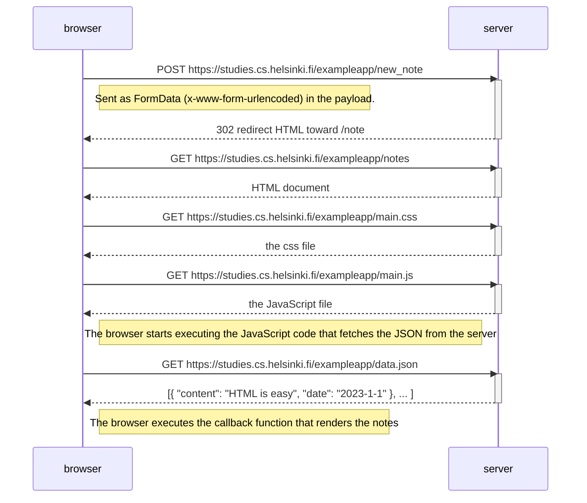
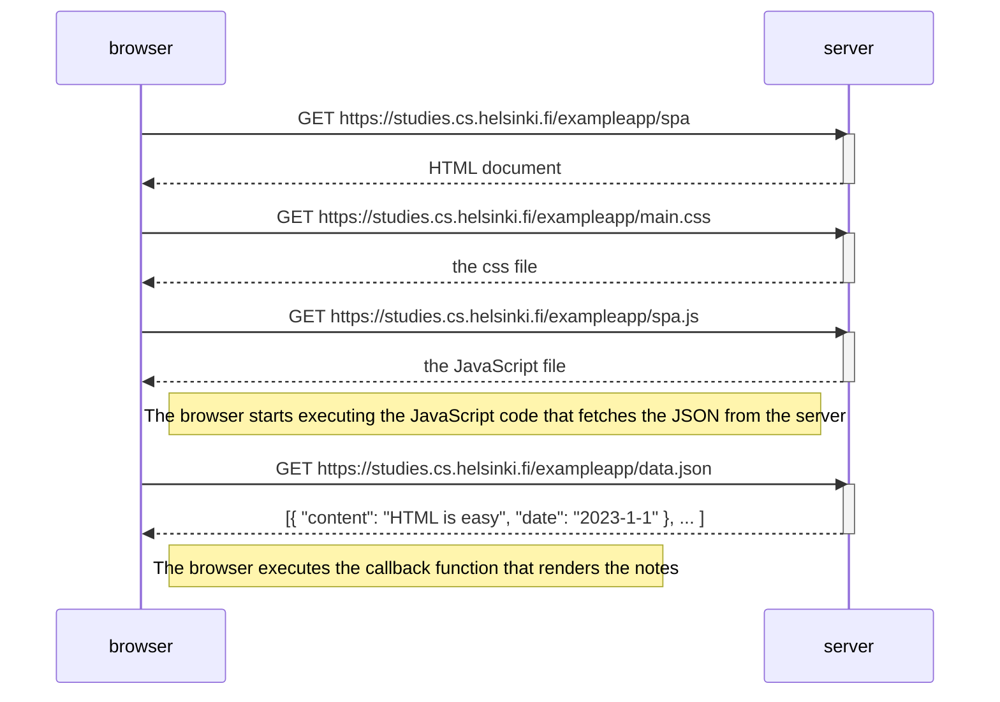
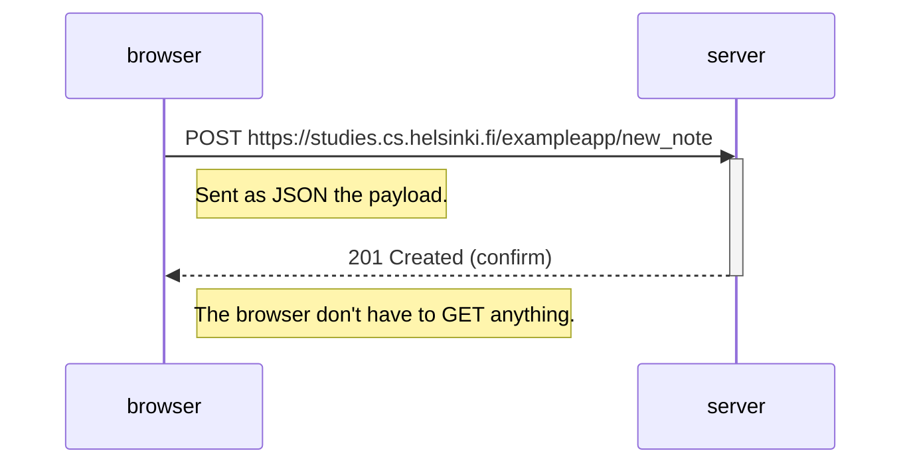

## New Note diagram

The diagram showing first full load of the page is prepended with the POST step:

- with the payload encoded as the special form type
- and the response a 302 code redirecting to the notes page (and triggering a refresh and a full reloading)

## Single page app

Going on SPA is the same as going on the first example, except for the URL and the name of the JS script:

## New note on SPA

But here it's just one controlled request (provided we correctly prevented default submit behaviour):

- The **rerendering** is done locally on the DOM
- Data are sent as json
- No refresh or reloading of anything

